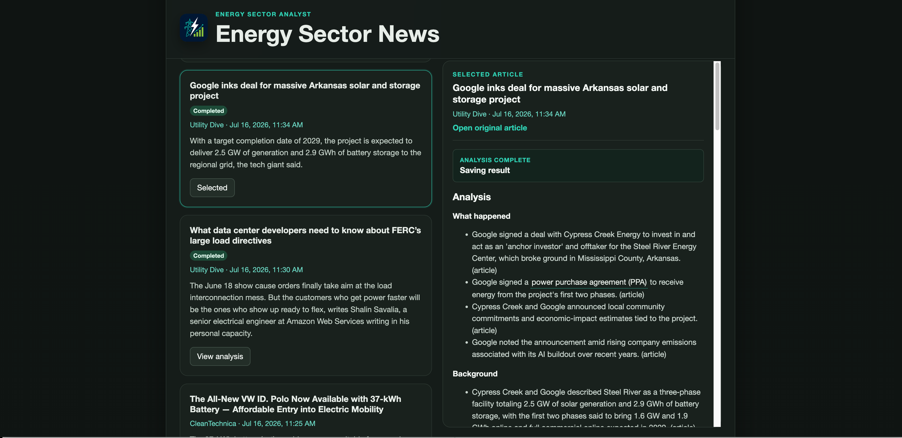
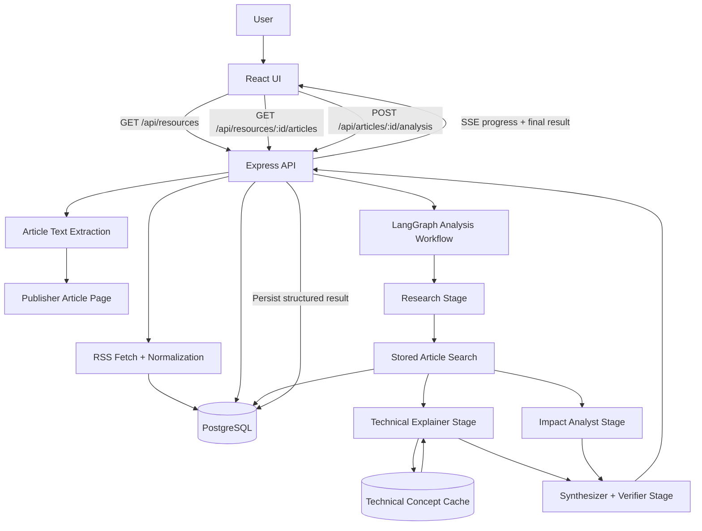
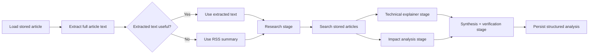

# Energy Sector Analyst

Energy Sector Analyst is a full-stack AI application for monitoring energy-sector news and turning individual articles into structured, explainable analysis.

The app ingests recent articles from multiple energy news RSS feeds, persists and deduplicates them in PostgreSQL, extracts full article text when a user requests analysis, and runs a staged OpenAI/LangGraph analysis workflow that separates facts, background, technical concepts, stakeholder impact, uncertainty, and related stored coverage.

This project is designed as a practical AI product, not just a prompt demo. It focuses on usability, retrieval from stored data, structured outputs, caching, transparent progress, safe failure handling, and testable backend boundaries.



## What It Demonstrates

- Full-stack TypeScript product development with React, Express, and PostgreSQL
- Staged AI workflow orchestration with LangGraph and OpenAI structured JSON outputs
- Streaming analysis progress over Server-Sent Events
- RSS ingestion, normalization, persistence, and source-level deduplication
- Full-text extraction with safe fallback to RSS summaries
- Cached analysis results to avoid repeat LLM spend
- Cached technical concept definitions to reduce redundant explanation work
- Structured validation and tests around ingestion, API routes, analysis, and persistence
- Product decisions around loading UX, explainability, and AI uncertainty

## Product Experience

The UI shows a combined feed of recent energy articles across configured sources. Users select an article from the left column and review or generate analysis in the right-side workspace.

When analysis is running, the app streams workflow progress and shows an active loading state with elapsed time. Completed analyses are stored, so selecting an already analyzed article shows the saved result immediately instead of running the workflow again.

The final analysis is intentionally structured:

- What happened
- Background needed to interpret the article
- Stakeholder impact
- Uncertainty and context limitations
- Related stored articles
- Technical concepts available on demand through highlighted terms

## Architecture



## Why A Staged AI Workflow?

A single prompt can summarize an article, but this app needs more than a summary. Energy-sector articles often mix technical terms, market context, regulatory implications, company actions, and uncertainty. A single monolithic prompt makes it harder to test, reason about, cache, and display intermediate progress.

The workflow uses separate structured LLM stages because each stage has a narrower job:

- The research stage identifies the central event, key entities, key terms, background questions, and context limitations.
- The related article search stage uses the research stage output to query stored articles for relevant prior coverage.
- The technical explainer focuses only on stable technical, market, regulatory, and industry concepts.
- The impact analyst evaluates stakeholders, possible consequences, reasoning, and confidence.
- The synthesizer combines prior structured outputs, removes unsupported claims, preserves uncertainty, and produces the final UI-ready analysis.

This structure gives the app better control over:

- Accuracy: prompts can require each stage to stay within its evidence boundary.
- Reliability: each output is validated against a schema.
- UX: the frontend can stream meaningful progress by stage.
- Cost: completed article analyses are reused, and technical concept explanations can be cached.
- Debuggability: logs show which stage failed and why.

## Analysis Workflow



### 1. Loading and Content Selection

When a user clicks Analyze, the backend first checks whether a completed analysis already exists. If it does, the stored result is streamed back immediately.

If no completed analysis exists, the backend:

1. Loads the stored article row.
2. Attempts to extract full text from the article URL with Mozilla Readability.
3. Uses the extracted text only when it is longer than the stored RSS summary.
4. Falls back to the RSS summary when extraction fails or returns short content.
5. Fails safely if the selected content is too short to analyze.

The extracted full text is used for the prompt but is not stored in the database.

### 2. Research Stage

The research stage reads the selected article content and returns structured research notes:

- Central event
- Key entities
- Key technical or market terms
- Background questions
- Context limitations

This stage keeps the workflow grounded. It identifies what the rest of the system should explain or investigate, without letting later stages invent missing context.

### 3. Related Article Search

The app searches previously stored articles using the research stage output. This gives the final analysis a limited retrieval layer: related articles come from the app's own database, not from live web browsing.

This is intentionally narrow. It avoids pretending to have complete world knowledge while still letting the app connect a new article to prior ingested coverage.

### 4. Technical Explainer Stage

The technical explainer focuses on stable domain concepts, not breaking-news claims. Examples might include resource adequacy, interconnection queues, integrated resource planning, virtual power plants, capacity markets, or grid reliability.

The app also stores technical concept definitions. When a term appears again, cached definitions can be reused as background while still generating article-specific relevance.

### 5. Impact Analyst Stage

The impact analyst identifies likely stakeholders and consequences. It must distinguish direct article-supported facts from interpretation and attach confidence levels to interpretive claims.

This keeps the final analysis useful without overstating certainty.

### 6. Synthesizer and Verifier Stage

The synthesizer combines the prior outputs into the final schema. Its job is not to create a longer summary. Its job is to produce a concise, structured answer that preserves uncertainty and labels source types:

- `article`
- `related_article`
- `model_background`
- `agent_interpretation`

## Data Flow

1. Configured RSS feeds are fetched through the backend.
2. Feed items are normalized into title, URL, publish date, and preview text.
3. Sources are persisted in PostgreSQL.
4. Articles are inserted with database-level deduplication on `(source_id, url)`.
5. The frontend loads recent articles across all configured sources.
6. Selecting an article shows a dedicated analysis workspace.
7. Running analysis streams progress through Server-Sent Events.
8. Final structured analysis is stored and reused on future views.

## News Sources

Configured sources live in `server/src/resources/config.ts`.

Current sources:

- Utility Dive
- Canary Media
- Energy-Storage.news
- CleanTechnica
- Power Technology

The RSS parser is intentionally defensive. Some feeds are sparse or inconsistent, so valid items are kept even when summary text is weak. If an item has title, URL, and publish date, the title can be used as the preview fallback.

## Technology Stack

### Frontend

- React
- TypeScript
- Vite
- Server-Sent Events parsing with `fetch`
- Responsive two-column analysis workspace

### Backend

- Node.js
- Express
- TypeScript
- LangGraph
- OpenAI API
- PostgreSQL
- `pg` connection pooling
- `rss-parser`
- Mozilla Readability and jsdom for article text extraction
- Node test runner

### Infrastructure

- Docker Compose for local development
- PostgreSQL initialization scripts
- Idempotent backend migrations
- Environment-based configuration

## API Surface

- `GET /`: backend status
- `GET /api/health`: backend and database health check
- `GET /api/resources`: list configured news sources
- `GET /api/resources/:resourceId/articles`: fetch, persist, deduplicate, and return recent articles for one source
- `GET /api/articles/:articleId/analysis`: return stored analysis state
- `POST /api/articles/:articleId/analysis`: run or return article analysis as a streaming SSE response

## Persistence Model

The app stores:

- News sources
- Article metadata and RSS preview content
- Structured article analysis results
- Stage outputs for observability/debugging
- Reusable technical concept definitions

The app does not store extracted full article text. Extraction is performed at analysis time and used only as prompt input.

## Reliability and Safety Choices

- Existing completed analyses are returned instead of rerunning the LLM workflow.
- Structured stage outputs are validated before use.
- User-visible errors are kept safe and concise.
- Backend logs include stage and extraction details for debugging.
- Full-text extraction has a timeout.
- RSS ingestion deduplicates at the database level.
- Individual source failures are tolerated in the frontend combined feed.
- The final analysis includes context limitations when the source content is weak or incomplete.

## Tradeoffs

### Staged workflow vs. one prompt

The staged workflow is slower and uses more LLM calls than a single summarization prompt. The benefit is better separation of responsibilities, clearer logs, schema validation per stage, reusable technical concept definitions, and a UI that can show meaningful progress.

For this project, the tradeoff is intentional: the goal is to demonstrate AI workflow design, not just fastest possible summarization.

### Full-text extraction at analysis time

The app fetches full article text only when the user asks for analysis. This makes initial feed loading faster and avoids storing copied article text. The tradeoff is that analysis can take longer and extraction quality varies by publisher page structure.

The backend mitigates this by falling back to the RSS summary and failing safely when selected content is too short.

### Stored analysis cache

Caching completed analysis reduces cost and makes repeated views instant. The tradeoff is that analysis can become stale if an article is updated after the first run.

The current implementation treats article analysis as a point-in-time result, which is appropriate for a portfolio project and simple local usage.

### Combined feed vs. source selector

The app now fetches all configured sources and shows one combined feed. This makes the product easier to use and removes a low-value control. The tradeoff is more backend requests during initial load.

The current number of sources is small, so this is acceptable. If the source list grows significantly, the backend could add an aggregate endpoint.

### Structured schemas vs. free-form prose

Strict schemas make the UI predictable and testable. The tradeoff is less flexibility in the model response. This is worthwhile because the frontend needs reliable fields, not arbitrary prose.

### Related articles from local storage only

The workflow searches stored articles instead of browsing the live web. This keeps behavior deterministic and easier to explain. The tradeoff is limited context until enough articles have been ingested.

## Local Development

### Docker Compose

1. Copy `.env.example` to `.env`.
2. Add an OpenAI API key if you want to run article analysis.
3. Start the stack:

```bash
docker compose up --build
```

Frontend: `http://localhost:8080`

Backend: `http://localhost:3000`

Health check: `http://localhost:3000/api/health`

The PostgreSQL schema is initialized automatically from `postgres/init/` the first time the database volume is created. The backend also runs idempotent migrations on startup.

To recreate the database from scratch:

```bash
docker compose down -v
docker compose up --build
```

### Local Node Development

Backend:

```bash
cd server
npm install
PORT=3000 HOST=0.0.0.0 PGHOST=localhost PGPORT=5432 PGDATABASE=energy_sector_analyst PGUSER=energy_app PGPASSWORD=change-this-local-password npm run dev
```

Frontend:

```bash
cd client
npm install
VITE_DEV_PROXY_TARGET=http://localhost:3000 npm run dev
```

If calling the backend directly instead of using the Vite proxy:

```bash
cd client
VITE_API_BASE_URL=http://localhost:3000/api npm run dev
```

## Environment Variables

Root `.env` values used by Docker Compose:

- `BACKEND_HOST`: backend bind host
- `BACKEND_PORT`: backend port exposed on the host
- `ALLOWED_ORIGINS`: comma-separated frontend origins allowed by the backend CORS middleware
- `POSTGRES_DB`: local PostgreSQL database name for Docker Compose
- `POSTGRES_USER`: local PostgreSQL application user for Docker Compose
- `POSTGRES_PASSWORD`: local PostgreSQL password for Docker Compose
- `PGHOST`: PostgreSQL host used by the backend
- `PGPORT`: PostgreSQL port used by the backend
- `PGDATABASE`: PostgreSQL database name used by the backend
- `PGUSER`: PostgreSQL user used by the backend
- `PGPASSWORD`: PostgreSQL password used by the backend
- `PGSSLMODE`: set to `require` when the backend should use TLS to reach PostgreSQL
- `PGPOOL_MAX`: maximum PostgreSQL pool size
- `PG_CONNECT_TIMEOUT_MS`: database connection timeout in milliseconds
- `PG_IDLE_TIMEOUT_MS`: idle pooled-connection timeout in milliseconds
- `OPENAI_API_KEY`: OpenAI API key used by the article-analysis workflow
- `OPENAI_MODEL`: OpenAI model used by the workflow
- `ARTICLE_EXTRACTION_TIMEOUT_MS`: timeout for full-text article extraction
- `VITE_API_BASE_URL`: frontend API base URL baked into the production frontend build
- `VITE_DEV_PROXY_TARGET`: Vite dev proxy target for local frontend development

## Testing

Backend tests cover RSS normalization, resource routes, article persistence, technical concept caching, analysis validation, health checks, and analysis route behavior.

```bash
cd server
npm test
npm run build
```

Frontend build verification:

```bash
cd client
npm run build
```

## Future Improvements

- Add an aggregate backend endpoint for all sources if source count grows.
- Add per-source freshness/error indicators in the UI.
- Add analysis versioning controls to intentionally rerun stale analyses.
- Add richer citation display for related stored articles.
- Add automated evaluation examples for analysis quality.
- Add deployment hardening such as request rate limiting and structured log aggregation.
